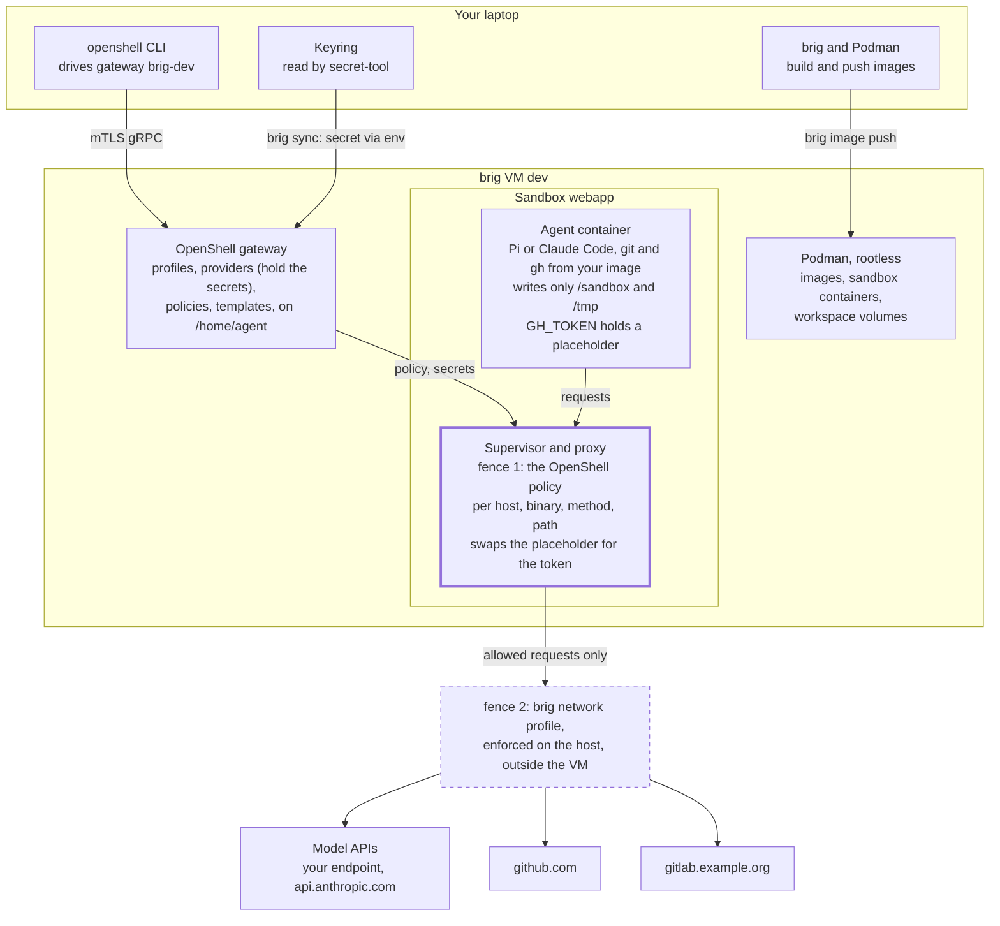
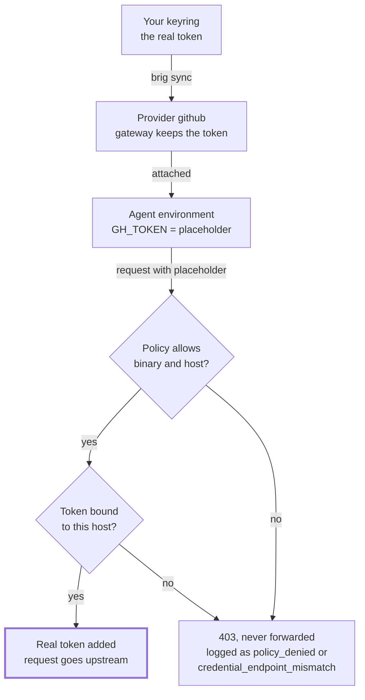

# Running agents with OpenShell on brig

This guide shows how to run coding agents in OpenShell sandboxes on a brig VM,
give them model and Git credentials without exposing your tokens, and keep
their work when images change. It assumes a VM `dev` from the [quick
start](../README.md#quick-start). Examples use the sandbox `webapp` for the
repository `alice/webapp` and the shared config directory
`~/src/agent-openshell`.

- [Run your first agent sandbox](#your-first-agent-sandbox-pi), or [Claude
  Code on your subscription](#claude-code-with-a-subscription)
- Let an agent push to
  [GitHub](#grant-push-and-pull-requests-for-one-repository) or
  [GitLab](#grant-push-and-merge-requests-for-one-project)
- [Keep agent state across sandbox deletes](#keeping-agent-state) and [update
  images](#keeping-images-up-to-date)
- [Fix a denied request](#troubleshooting)

## How the pieces fit together

You drive everything from your laptop's `openshell` CLI. brig gives each VM
its own OpenShell gateway, the gateway runs each agent in a sandbox container,
and everything a sandbox sends leaves through that sandbox's proxy.



A request leaves only if both fences allow it: the sandbox's OpenShell policy,
enforced by its proxy per host, port, binary, method and path, and the VM's
brig network profile, enforced on the host outside the VM. The proxy adds the
real token only on requests to the provider's endpoints; the agent's container
never sees it.

- **Host.** `eval "$(brig env dev)"` points the `openshell` CLI at VM `dev`,
  registered as gateway `brig-dev`; `secret-tool` reads your keyring (GNOME
  Keyring or KeePassXC).
- **VM.** Headless Fedora; the gateway runs as user `agent`, keeps its state
  on the data disk at `/home/agent`, and starts sandboxes as rootless Podman
  containers.
- **Sandbox.** A container from the image you pass to `--from`, with its
  workspace at `/sandbox`.

## Core concepts

Six objects do all the work:

| Object | What it is | Holds secrets | Created with | Lives |
| --- | --- | --- | --- | --- |
| Gateway | The control plane of one brig VM, registered on the host as `brig-NAME` | Yes, providers' | `brig create` | VM data disk |
| Workspace | A tenant inside a gateway; brig uses `default` | No | built in | gateway |
| Provider profile | A type definition: which env vars hold the credential, how it is sent (bearer, header, Basic, query), to which endpoints, from which binaries | No | `openshell profile import -f FILE` (workspace) or `--global` (platform) | gateway |
| Provider | A named instance of a profile with your actual token | Yes | `brig sync` from a [config directory](#openshell-config-directories) | gateway |
| Policy | Filesystem, process and network rules for one sandbox | No | `--policy FILE` or `OPENSHELL_SANDBOX_POLICY` at create; `openshell policy set` later | sandbox record |
| Sandbox | A container running your agent image, with workspace `/sandbox` | Placeholders only | `openshell sandbox create --from IMAGE` | Podman in the VM |

A gateway starts with no profiles. OpenShell's
[`providers/`](https://github.com/NVIDIA/OpenShell/tree/v0.1.2/providers)
directory has examples, such as `github.yaml`, `openai.yaml` and
`claude-code.yaml`, to copy and adapt: their `binaries` must name the
executables in your image.

### Providers and sandboxes are many-to-many

A sandbox can carry several providers (`--provider llm --provider github`), and
one provider can serve many sandboxes. Attach or detach later with `openshell
sandbox provider attach SANDBOX PROVIDER`; only processes the sandbox starts
afterwards see the change: a new `openshell sandbox exec` shell, or every
process after `openshell sandbox stop` and `start`. A program restarted from a
shell that was already open keeps the old variables. Each attached provider
also adds a network rule named `_provider_<name>` to the sandbox's effective
policy, so attaching `github` is what opens `api.github.com` and `github.com`.



The agent's environment holds only a placeholder such as
`openshell:resolve:env:GH_TOKEN`. The proxy swaps in the token, in headers,
Basic auth, query strings and URL paths, only on requests the policy allows
and only to the profile's endpoints; endpoints can also opt in to rewriting
JSON, form and text bodies and WebSocket messages. A profile's `binaries`
decide which processes its network rule admits. Client certificates and SSH
keys cannot be provided this way, so use HTTPS remotes for git.

### Which policy a sandbox gets

OpenShell picks the first that exists:

1. A global policy set on the gateway.
2. The policy given at create: `--policy FILE`, or the file named by
   `OPENSHELL_SANDBOX_POLICY`, which `brig env` sets from your config
   directory.
3. `/etc/openshell/policy.yaml` baked into the image.
4. The built-in default: workdir and `/tmp` writable; `/usr`, `/lib`, `/etc`
   and a few more read-only; no network at all.

That is the **base** policy. The **effective** policy adds the rules of
attached providers; compare them with `openshell policy get SANDBOX --base`
and `--full`. Network rules hot-reload with `openshell policy set` or
`openshell policy update`; filesystem and process settings are fixed once a
sandbox starts. To learn what an agent needs, set `enforcement: audit` on a
new rule so it logs instead of blocking; this works only for hosts no attached
provider covers, because overlapping endpoints must agree on enforcement.

## OpenShell config directories

Keep profiles, providers and the default policy in directories, not in your
shell history. brig applies them to a VM's gateway at every `brig start` and
on `brig sync`, so a new or rebuilt VM is set up in one command. Split them in
two: a shared directory without secrets, which can live in git, and a personal
one that only points into your keyring.

```text
~/src/agent-openshell/              # shared, in git
  profiles/
    llm.yaml                        # your own, see the Pi section
    claude-code.yaml                # OpenShell's, edited, see the Claude Code section
    github.yaml                     # copy of OpenShell's, binaries checked
    gitlab-work.yaml                # your own, see the GitLab section
  policies/
    default.yaml                    # default policy for new sandboxes
    webapp.yaml                     # a project's policy, see the GitHub section
~/.config/brig/openshell/           # personal, never in git
  providers/
    llm.yaml
    claude-code.yaml
    github.yaml
    gitlab-work.yaml
```

A provider file names the profile it instantiates and where each credential is
in your keyring; brig refuses values.

```yaml
# ~/.config/brig/openshell/providers/github.yaml
name: github
type: github                      # profile id
credentials:
  GH_TOKEN:
    secret_tool:                  # the arguments of `secret-tool lookup`
      lookup: [service, github.com, user, alice]
```

Store each secret once, then attach both directories to the VM and preview:

```sh
secret-tool store --label='GitHub token (agents)' service github.com user alice
secret-tool store --label='LLM key (agents)' service llm.example.com

brig update dev --add-openshell-config ~/src/agent-openshell \
                --add-openshell-config ~/.config/brig/openshell
brig sync dev --dry-run      # what would change, and where each token may be sent
brig sync dev
```

For new VMs, list both under `openshell.configs` in
`~/.config/brig/config.yaml`. To use another keyring client with the same
`lookup` arguments, such as a wrapper around `pass`, set
`openshell.secret_tool` there; config directories cannot set it, so a shared
one cannot run programs on your host.

The default policy is a complete policy file. Keep it small and without
network rules, since attached providers add theirs. Once a file has a
`filesystem_policy`, the workspace is writable only with `include_workdir:
true`:

```yaml
# policies/default.yaml
version: 1
filesystem_policy:
  include_workdir: true          # /sandbox
  read_only: [/bin, /usr, /lib, /etc, /proc, /dev/urandom, /var/log]
  read_write: [/tmp, /dev/null]
landlock:
  compatibility: best_effort
```

### What a sync does

| Item | Applied as | Updated when | Deleted |
| --- | --- | --- | --- |
| `profiles/*.yaml` | workspace profile, overriding a `--global` one with the same id | the file changes | only with `--prune`, only if brig created it |
| `providers/*.yaml` | provider; secrets reach `openshell` only in its environment | a keyed fingerprint of a secret changes, or `--refresh-secrets` | only with `--prune`, only if brig created it |
| `policies/default.yaml` | exported by `eval "$(brig env dev)"` as `OPENSHELL_SANDBOX_POLICY` | read at each `openshell sandbox create` | never; running sandboxes keep their policy |

A profile, provider or default policy defined in two directories is an error.
Files whose names start with a dot, such as an editor's lock file, are ignored.
Profiles and providers you created by hand are touched only when a directory
defines them. A sync does not touch templates, global policies or the policies
of existing sandboxes.

Two safety rules matter when you share a directory. A provider's secret may be
sent to every endpoint in its profile, so read a shared profile's `endpoints`
before pairing it with your token; `--dry-run` prints them. And `brig start`
holds back a profile change that adds endpoints, changes an endpoint's path or
removes all endpoints (so sandbox policies decide) for a credential the gateway
already holds; only an explicit `brig sync` applies it, and it names the new
endpoints.

## Your first agent sandbox: Pi

[Pi](https://pi.dev) has no official image, so you build one. Everything you
curate (Pi, tools, your extensions and skills) goes into the image under
`/usr/local`; everything Pi writes (settings, sessions) goes under `/sandbox`.
The default policy lets a sandbox read `/usr` and write only `/sandbox` and
`/tmp`, and only `/sandbox` persists.

| What | Where | Why |
| --- | --- | --- |
| Node, Pi, git, gh, glab, ripgrep, fd | image, `/usr/local` and `/usr/bin` | readable by default; updated by rebuilding the image |
| Your extensions, skills, prompts, themes | image, `/usr/local/share/pi-kit` (a Pi package) | loaded by path, so a new image brings new versions |
| Third-party Pi packages | image, `npm install -g` at build time | the sandbox cannot reach npm or GitHub at run time |
| Your model endpoint and its models | image, `/usr/local/etc/pi/models.json` | linked into Pi's agent dir, so a new image brings a new model list |
| Pi's agent dir: `settings.json`, `sessions/` | `/sandbox/.pi/agent` via `PI_CODING_AGENT_DIR` | writable and persistent; `~` is not writable |
| Project checkouts | `/sandbox/<repo>` | same workspace volume |
| Plugins under development | host directory, mounted read-only | edit on the host, `/reload` in Pi |

### The image

```text
pi-image/
  Containerfile
  pi-sandbox                  # start script, below
  etc/settings.json           # Pi settings for a fresh sandbox
  etc/models.json             # your model endpoint, see Model endpoint
  etc/AGENTS.md               # your standing instructions
  pi-kit/                     # your Pi package
    package.json
    extensions/  skills/  prompts/  themes/
```

```dockerfile
# Containerfile
FROM registry.fedoraproject.org/fedora-minimal:44

ARG PI_VERSION=1.1.0
RUN dnf -y install --setopt=install_weak_deps=False \
      fd-find gh git-core jq nodejs24 nodejs24-bin nodejs24-npm-bin ripgrep \
 && dnf clean all \
 && useradd --create-home --uid 1000 pi
# glab: add it to the list if your Fedora release packages it, or install the
# .rpm from its releases page, at /usr/bin/glab
# npm's global installs go to /usr/local, where the paths below expect them.
ENV NPM_CONFIG_PREFIX=/usr/local

RUN npm install -g --ignore-scripts "@earendil-works/pi-coding-agent@${PI_VERSION}"
# Third-party Pi packages, pinned. --legacy-peer-deps keeps npm from
# installing a second copy of Pi, which Pi's packages must not bundle.
RUN npm install -g --ignore-scripts --legacy-peer-deps @example/pi-tools@1.0.0

COPY pi-kit/ /usr/local/share/pi-kit/
RUN cd /usr/local/share/pi-kit \
 && npm install --omit=dev --ignore-scripts --legacy-peer-deps
COPY etc/ /usr/local/etc/pi/
COPY --chmod=755 pi-sandbox /usr/local/bin/pi-sandbox

RUN git config --system credential.https://github.com.helper \
      '!/usr/bin/gh auth git-credential'

USER pi
WORKDIR /sandbox
ENV PI_CODING_AGENT_DIR=/sandbox/.pi/agent \
    GH_CONFIG_DIR=/sandbox/.config/gh \
    GIT_CONFIG_GLOBAL=/sandbox/.gitconfig \
    PI_OFFLINE=1 PI_SKIP_VERSION_CHECK=1 PI_TELEMETRY=0
```

The image builds on Fedora minimal, like the VMs: glibc, so whatever an agent
installs or downloads runs, and current packages, such as Node 24. `fd` and
`ripgrep` are in the image because Pi otherwise downloads them on first use,
which the sandbox blocks. The `PI_*` switches stop Pi's own update
checks and telemetry, which would only show up as denials. Do not put files
under `/sandbox` in the image: Podman copies them into a sandbox's workspace
once, at creation, and image updates never reach them again.

The start script copies Pi's settings into a fresh sandbox (copied, not
linked, because Pi writes to them) and links what the image keeps managing:

```sh
#!/bin/sh
# pi-sandbox: start Pi with this image's settings, extensions and skills
set -e
mkdir -p "$PI_CODING_AGENT_DIR"
[ -e "$PI_CODING_AGENT_DIR/settings.json" ] ||
  cp /usr/local/etc/pi/settings.json "$PI_CODING_AGENT_DIR/settings.json"
ln -sf /usr/local/etc/pi/AGENTS.md "$PI_CODING_AGENT_DIR/AGENTS.md"
ln -sf /usr/local/etc/pi/models.json "$PI_CODING_AGENT_DIR/models.json"
exec pi "$@"
```

`etc/settings.json` lists packages by absolute path, so they load in place and
a newer image brings new code:

```json
{
  "packages": [
    "/usr/local/share/pi-kit",
    "/usr/local/lib/node_modules/@example/pi-tools"
  ],
  "defaultProvider": "llm",
  "defaultModel": "your-model-id"
}
```

Build with Podman on the host and copy the image into the VM, tagged by date
so you can tell images apart and go back:

```sh
podman build -t localhost/pi-agent:2026-10-08 pi-image/
brig image push dev localhost/pi-agent:2026-10-08
```

### Model endpoint

Pi talks to any endpoint that speaks OpenAI's chat completions API: most
hosted services, such as OpenRouter, OpenAI, NVIDIA NIM, DeepInfra, Together
and Groq, and self-hosted servers such as vLLM, LiteLLM and Ollama. One profile,
one provider and one `models.json` entry connect it. The profile is your own,
in the shared directory:

```yaml
# profiles/llm.yaml
id: llm
display_name: LLM endpoint
description: An OpenAI-compatible inference endpoint
category: inference
inference_capable: true
credentials:
  - name: api_key
    description: The endpoint's API key
    env_vars: [LLM_API_KEY]
    required: true
    auth_style: bearer
    header_name: authorization
discovery:
  credentials: [api_key]
endpoints:
  - host: llm.example.com         # the host in baseUrl below
    port: 443
    protocol: rest
    access: read-write
    enforcement: enforce
binaries: [/usr/bin/node, /usr/bin/node-*]   # node by its real path, whichever it is
```

The provider file looks up `LLM_API_KEY` as `service llm.example.com`, like
the GitHub one above. `etc/models.json` tells Pi where the endpoint is and
which models it serves:

```json
{
  "providers": {
    "llm": {
      "baseUrl": "https://llm.example.com/v1",
      "api": "openai-completions",
      "apiKey": "$LLM_API_KEY",
      "models": [{ "id": "your-model-id" }]
    }
  }
}
```

Pi sends the placeholder in `LLM_API_KEY` as a bearer token, and the proxy
swaps in your key on requests to the profile's host. The profile admits only
`node` there; a rule that lets other programs reach that host lets them use the
key too. To change endpoints, change the host in both files. A server on your
LAN or on the host also needs its port in the profile and a [network
profile](../README.md#configuration) for the VM that allows it, such as
`ollama`. For a service that Pi knows by name, such as OpenRouter, you can drop
`models.json` and use the service's own variable (`OPENROUTER_API_KEY`) in the
profile, so that Pi offers its built-in model list. Do not run Pi's `/login` in
a sandbox: it would store a real token in `auth.json` there.

### Start it

```sh
brig sync dev                     # applies the profiles and providers above
eval "$(brig env dev)"
openshell sandbox create --name webapp \
  --from localhost/pi-agent:2026-10-08 \
  --provider llm --provider github
# now in a login shell inside the sandbox
git clone https://github.com/alice/webapp.git && cd webapp
pi-sandbox
```

Clone with the `.git` suffix: git uses the URL as given, and the push rules
[below](#grant-push-and-pull-requests-for-one-repository) match it.

Without a trailing command, the sandbox's main process is a login shell and
the sandbox stays after you leave. Press `Ctrl-P`, `Ctrl-Q` to detach with Pi
still working; `openshell sandbox connect webapp` reattaches. For a second
shell, run `openshell sandbox exec -n webapp --tty -- bash -l`. These
commands run your host's `ssh`, which reads `~/.ssh/config`: make sure no
`Host *` block there turns on `ForwardAgent` or other forwarding, since the
other end is the VM.

A template saves the image, environment, resources and driver config under a
name: create it once with `openshell sandbox template create pi --image
localhost/pi-agent:2026-10-08`, then `openshell sandbox create --template pi`
needs only providers and a policy. Templates live in the gateway; recreate
them after a fresh VM.

### Developing plugins without rebuilding

While you write an extension or skill, mount its directory instead of baking
it. Give the VM a read-only sandbox mount, which brig exposes as a Podman
volume (`brig show dev` names it, here `brig0`), and attach it to a sandbox:

```sh
brig update dev --add-mount ~/src/pi-kit:/pi-kit:ro,sandbox
brig stop dev && brig start dev     # mounts change at boot
openshell sandbox create --name kit-dev --from localhost/pi-agent:2026-10-08 \
  --provider llm --driver-config-json \
  '{"podman":{"mounts":[{"type":"volume","source":"brig0","target":"/usr/local/share/pi-kit-dev"}]}}'
# in the sandbox
pi-sandbox -e /usr/local/share/pi-kit-dev
```

Edits on the host appear in the sandbox at once; `/reload` in Pi picks them
up. The mount is read-only, so the agent cannot change your plugin source, and
mounting under `/usr` keeps it readable under the default policy. When the
plugin is done, copy it into `pi-kit/` and rebuild.

Repository-level `.pi/extensions`, `.pi/skills` and `.pi/prompts` also work,
after Pi asks you to trust the project. Package declarations in a repository's
`.pi/settings.json` do not, because Pi would have to fetch them from npm.

## Claude Code with a subscription

[Claude Code](https://code.claude.com) can run on your Claude Pro or Max
subscription. `claude setup-token` makes a token for it that is valid for a
year; the sandbox gets a placeholder, and the proxy adds the real token on
requests to `api.anthropic.com`, which the profile opens to Claude Code only.
As with Pi, the image holds the program, your instructions and your skills, and
`/sandbox` holds what Claude Code writes.

| What | Where | Why |
| --- | --- | --- |
| Claude Code, git, gh, ripgrep | image, `/usr/local/bin` and `/usr/bin` | pinned at build time; Claude Code's own updates are off |
| No updates, telemetry or error reports | image, `/etc/claude-code/managed-settings.json` | managed settings win over user and project settings |
| Your standing instructions and skills | image, `/usr/local/etc/claude` and `/usr/local/share/claude-kit/skills` | linked into the config dir, so a new image brings new versions |
| Claude Code's config dir: `.claude.json`, `settings.json`, sessions under `projects/` | `/sandbox/.claude` via `CLAUDE_CONFIG_DIR` | writable and persistent |

### The image

```text
claude-image/
  Containerfile
  claude-sandbox              # start script, below
  managed-settings.json
  etc/CLAUDE.md               # your standing instructions
  skills/                     # your skills, one directory each
```

```dockerfile
# Containerfile
FROM registry.fedoraproject.org/fedora-minimal:44

ARG CLAUDE_VERSION=2.1.295
RUN dnf -y install --setopt=install_weak_deps=False gh git-core jq ripgrep \
 && dnf clean all
# The native installer installs into $HOME; keep only its single binary.
RUN curl -fsSL https://claude.ai/install.sh | HOME=/tmp/claude bash -s "$CLAUDE_VERSION" \
 && install -m 755 "$(readlink -f /tmp/claude/.local/bin/claude)" /usr/local/bin/claude \
 && rm -rf /tmp/claude

COPY --chmod=644 managed-settings.json /etc/claude-code/managed-settings.json
COPY etc/ /usr/local/etc/claude/
COPY skills/ /usr/local/share/claude-kit/skills/
COPY --chmod=755 claude-sandbox /usr/local/bin/claude-sandbox

RUN git config --system credential.https://github.com.helper \
      '!/usr/bin/gh auth git-credential' \
 && useradd --create-home --uid 1000 claude

USER claude
WORKDIR /sandbox
ENV CLAUDE_CONFIG_DIR=/sandbox/.claude \
    GH_CONFIG_DIR=/sandbox/.config/gh \
    GIT_CONFIG_GLOBAL=/sandbox/.gitconfig
```

The managed settings turn off what would only show up as denials: updates,
telemetry, error reports (on by default for subscriptions) and Claude Code's
bundled ripgrep, in favour of the image's. The file must be readable by every
user, or Claude Code silently ignores it:

```json
{
  "env": {
    "DISABLE_UPDATES": "1",
    "CLAUDE_CODE_DISABLE_NONESSENTIAL_TRAFFIC": "1",
    "DISABLE_ERROR_REPORTING": "1",
    "USE_BUILTIN_RIPGREP": "0"
  }
}
```

The start script links what the image keeps managing into the config dir:

```sh
#!/bin/sh
# claude-sandbox: start Claude Code with this image's instructions and skills
set -e
mkdir -p "$CLAUDE_CONFIG_DIR"
ln -sf /usr/local/etc/claude/CLAUDE.md "$CLAUDE_CONFIG_DIR/CLAUDE.md"
ln -sfn /usr/local/share/claude-kit/skills "$CLAUDE_CONFIG_DIR/skills"
exec claude "$@"
```

```sh
podman build -t localhost/claude-agent:2026-10-09 claude-image/
brig image push dev localhost/claude-agent:2026-10-09
```

### Subscription token

On the host, `claude setup-token` signs you in through the browser and prints
the token without saving it. Store it in the keyring:

```sh
claude setup-token
secret-tool store --label='Claude Code token (agents)' service claude.ai user alice
```

Copy OpenShell's
[`providers/claude-code.yaml`](https://github.com/NVIDIA/OpenShell/blob/v0.1.2/providers/claude-code.yaml)
into `profiles/` and replace its API key with the subscription token. Keep
`api.anthropic.com`, and add `platform.claude.com` read-only: Claude Code's
first-run setup checks it and exits when it cannot reach it. With the image's
settings, Claude Code needs nothing else.

```yaml
# profiles/claude-code.yaml: credentials, endpoints and binaries changed
credentials:
  - name: oauth_token
    description: Claude subscription token from claude setup-token
    env_vars: [CLAUDE_CODE_OAUTH_TOKEN]
    required: true
    auth_style: bearer
    header_name: authorization
discovery:
  credentials: [oauth_token]
endpoints:
  - host: api.anthropic.com
    port: 443
    protocol: rest
    access: read-write
    enforcement: enforce
  - host: platform.claude.com
    port: 443
    protocol: rest
    access: read-only
    enforcement: enforce
binaries: [/usr/local/bin/claude]
```

```yaml
# ~/.config/brig/openshell/providers/claude-code.yaml
name: claude-code
type: claude-code
credentials:
  CLAUDE_CODE_OAUTH_TOKEN:
    secret_tool:
      lookup: [service, claude.ai, user, alice]
```

Claude Code sends the placeholder in `CLAUDE_CODE_OAUTH_TOKEN` as a bearer
token, and the proxy swaps in your token. Three things to know:

- An `ANTHROPIC_API_KEY` or `ANTHROPIC_AUTH_TOKEN` in the sandbox wins over
  the subscription, so do not attach a provider that sets one, such as
  OpenShell's unchanged `claude-code` or `anthropic` profile.
- The token only makes model requests: claude.ai connectors and Remote Control
  do not work with it. Do not run `/login` in a sandbox: it would store a real
  token in `/sandbox/.claude`.
- After a year, run `claude setup-token` again, store the new token under the
  same attributes and run `brig sync dev`. Then start Claude Code from a new
  shell, `openshell sandbox exec -n webapp-claude --tty -- bash -l`, or stop
  and start the sandbox: a Claude Code restarted in an old shell keeps sending
  the old token.

### Start it

```sh
brig sync dev                     # applies the profile and provider above
eval "$(brig env dev)"
openshell sandbox create --name webapp-claude \
  --from localhost/claude-agent:2026-10-09 \
  --provider claude-code --provider github
# now in a login shell inside the sandbox
git clone https://github.com/alice/webapp.git && cd webapp
claude-sandbox
```

The first start walks through Claude Code's setup screens once; the answers
stay in `/sandbox/.claude`. `claude-sandbox --continue` resumes the last
conversation in the current directory. Detaching, templates and the GitHub
setup below work as for Pi.

## Giving agents GitHub and GitLab access

A GitHub or GitLab provider gives an agent read access: clone, fetch and API
reads. Pushes and pull or merge requests stay denied until a policy grants
them for a named repository, so grant writes per project, not in the shared
default.

### GitHub with gh

Both images above install `git` and `gh` at `/usr/bin`, the paths in
OpenShell's
[`providers/github.yaml`](https://github.com/NVIDIA/OpenShell/blob/v0.1.2/providers/github.yaml),
and makes `gh` git's credential helper, so git sends the placeholder in Basic
auth for the proxy to resolve. Copy that profile into `profiles/` unchanged.
It sends `GITHUB_TOKEN` or `GH_TOKEN` as a bearer token to `api.github.com`
(REST and GraphQL, read-only) and `github.com` (clone and fetch only).

Create a fine-grained token limited to the repositories agents may touch, with
Contents and Pull requests read-write and Metadata read, and reference it from
`providers/github.yaml` as [above](#openshell-config-directories). With
`--provider github`, `gh` works without `gh auth login`.

### Grant push and pull requests for one repository

Keep a policy file per project next to the default, here
`policies/webapp.yaml`: the default's content plus these rules. Pass it at
create with `--policy`, or apply it to a running sandbox with `openshell
policy set webapp --policy policies/webapp.yaml --wait`.

```yaml
network_policies:
  github_push_webapp:
    name: github-push-webapp
    endpoints:
      - host: github.com
        port: 443
        protocol: rest
        enforcement: enforce
        rules:
          - allow: { method: GET,  path: "/alice/webapp.git/info/refs*" }
          - allow: { method: POST, path: "/alice/webapp.git/git-upload-pack" }
          - allow: { method: POST, path: "/alice/webapp.git/git-receive-pack" }
    binaries:
      - path: /usr/bin/git
  github_prs_webapp:
    name: github-prs-webapp
    endpoints:
      - host: api.github.com
        port: 443
        protocol: rest
        enforcement: enforce
        rules:
          - allow: { method: POST, path: "/repos/alice/webapp/pulls" }
          - allow: { method: POST, path: "/repos/alice/webapp/issues/*/comments" }
    binaries:
      - path: /usr/bin/gh
```

The agent opens pull requests and comments on them, but cannot merge, close
them or change the repository. `gh pr create` uses GraphQL, which the github
profile keeps read-only in every sandbox, so have the agent use REST:
`gh api repos/alice/webapp/pulls -f title=TITLE -f head=BRANCH -f base=main`.
`git-receive-pack` lets it push any branch, `main` included: protect `main`
on GitHub with a ruleset that requires a pull request, so that only your
review merges. Always set `enforcement: enforce` on your own endpoints: on an
inspected endpoint, `audit` is the default and only logs.

### GitLab with glab

OpenShell ships no GitLab profile, so write one. One host serves the API and
git: `glab` sends the token as `PRIVATE-TOKEN`, `git` as a Basic-auth
password. Replace `gitlab.example.org` with your instance, or `gitlab.com`.
Like GitHub's, the profile allows reads and clones but not pushes:

```yaml
# profiles/gitlab-work.yaml
id: gitlab-work
display_name: GitLab (work)
description: GitLab API and git over HTTPS on gitlab.example.org
category: source_control
credentials:
  - name: api_token
    description: GitLab personal or project access token
    env_vars: [GITLAB_TOKEN]
    required: true
    auth_style: header
    header_name: private-token
discovery:
  credentials: [api_token]
endpoints:
  - host: gitlab.example.org
    port: 443
    protocol: rest
    enforcement: enforce
    allow_encoded_slash: true        # API paths look like /projects/group%2Fproject
    rules:
      - allow: { method: GET, path: "**" }
      - allow: { method: HEAD, path: "**" }
      - allow: { method: OPTIONS, path: "**" }
      - allow: { method: POST, path: "/**/git-upload-pack" }
binaries: [/usr/bin/glab, /usr/local/bin/glab, /usr/bin/git, /usr/local/bin/git]
```

Without `allow_encoded_slash`, OpenShell's proxy rejects the `%2F` in GitLab's
project paths, so every `glab` call on a project is denied.

The profile lets sandboxes read anything on the host that the token can, so
use a project or group access token with the Developer role, limited to the
projects agents work on: `api` scope, or `read_api` plus `read_repository`
while the agent only reads. A personal token would also open every other
project you can see, and the CI/CD variables of those you maintain.

```sh
secret-tool store --label='GitLab token (agents)' service gitlab.example.org user alice
```

```yaml
# providers/gitlab-work.yaml
name: gitlab-work
type: gitlab-work
credentials:
  GITLAB_TOKEN:
    secret_tool:
      lookup: [service, gitlab.example.org, user, alice]
```

In the image, install `glab` at `/usr/bin/glab`, point it at your host, and
give `git` a credential helper that reads the same variable. Inside a
checkout, `glab` also finds the host from the git remote.

```dockerfile
ENV GITLAB_HOST=gitlab.example.org
RUN git config --system credential.https://gitlab.example.org.helper \
      '!f() { test "$1" = get && printf "username=oauth2\npassword=%s\n" "$GITLAB_TOKEN"; }; f'
```

### Grant push and merge requests for one project

Add to that project's policy file:

```yaml
network_policies:
  gitlab_push_tools:
    name: gitlab-push-tools
    endpoints:
      - host: gitlab.example.org
        port: 443
        protocol: rest
        enforcement: enforce
        allow_encoded_slash: true
        rules:
          - allow: { method: GET,  path: "/group/tools.git/info/refs*" }
          - allow: { method: POST, path: "/group/tools.git/git-upload-pack" }
          - allow: { method: POST, path: "/group/tools.git/git-receive-pack" }
          - allow: { method: POST, path: "/api/v4/projects/group%2Ftools/merge_requests" }
          - allow: { method: POST, path: "/api/v4/projects/group%2Ftools/merge_requests/*/notes" }
    binaries:
      - path: /usr/bin/git
      - path: /usr/bin/glab
```

The last two rules let `glab mr create` and `glab mr note` open merge requests
and comment on them, but not merge them or change the project. Protect the
default branch so that the agent's pushes cannot reach it. Some `glab` commands look a project up by numeric ID or use
GraphQL at `/api/graphql`; if one is denied, take the exact path from
`openshell logs SANDBOX --source sandbox` and add it. Keep `enforcement:
enforce` here: an `audit` rule would overlap the provider's `enforce`
endpoint, and OpenShell rejects that.

## Keeping agent state

`openshell sandbox delete` loses a sandbox's work, and you run it to move a
sandbox to a new image. `brig delete` loses it too, and so does a `--no-keep`
sandbox when its main process exits; never use `--no-keep` for interactive
work. Everything else, from detaching to `brig upgrade`, keeps `/sandbox`. So
treat a sandbox as long-lived, push code continuously, and copy the agent's
sessions out before you delete.

| Event | Running agent | `/sandbox`: checkouts, agent settings and sessions | Gateway: providers, profiles, templates | Images in the VM |
| --- | --- | --- | --- | --- |
| `Ctrl-P`, `Ctrl-Q`; laptop sleep; network drop | keeps running | kept | kept | kept |
| The agent exits or crashes | gone; `--continue` resumes | kept, sessions are written as you go | kept | kept |
| `openshell sandbox stop` / `start` | gone | kept | kept | kept |
| `brig stop` / `brig start` | gone | kept | kept, then re-synced | kept |
| `brig upgrade` | gone | kept: data disk | kept: data disk | kept |
| `openshell sandbox delete`, or recreate for a new image | gone | **lost** | kept | kept |
| `brig delete` | gone | **lost** | **lost**; config dirs rebuild profiles and providers | **lost** |

### Habits that make deletes safe

1. **Git is the record for code.** Grant the sandbox push access to its
   repository, on [GitHub](#grant-push-and-pull-requests-for-one-repository)
   or [GitLab](#grant-push-and-merge-requests-for-one-project), and have the
   agent commit and push a work branch often.
2. **Copy sessions out before a delete.** Pi's sessions are JSONL files under
   `/sandbox/.pi/agent/sessions`, grouped by working directory; `download`
   paths are relative to `/sandbox`:

   ```sh
   openshell sandbox download webapp .pi/agent/sessions ~/pi-sessions/webapp/sessions
   ```

   After recreating the sandbox and cloning to the same path, upload them so
   `pi-sandbox --continue` finds them:

   ```sh
   openshell sandbox upload webapp ~/pi-sessions/webapp/sessions .pi/agent
   ```

   For a single conversation, Pi's `/export` writes HTML or JSONL instead.
   Claude Code keeps its sessions under `/sandbox/.claude/projects`; copy
   that directory out and back the same way.
3. **Keep what you would miss in `/sandbox`.** `/tmp` and the rest of the
   container layer may not survive a restart.
4. **Rebuild the VM from files, not memory.** Profiles, providers and the
   default policy come back from your config directories on the first `brig
   start`; recreate templates with a short script kept next to them.

The data disk holds every image and workspace and fills up over time: `df -h
/home/agent` in `brig ssh dev` shows how full it is, and `brig update dev
--data-disk 80GiB` grows it at the next boot.

## Daily workflow

Keep one VM, and one long-lived sandbox per project.

### Start of day

1. `brig start dev` boots the VM, re-registers the gateway and syncs your
   config directories; the keyring may ask to be unlocked.
2. `eval "$(brig env dev)"` in each terminal that runs `openshell`.
3. `openshell sandbox list`; start any that are `Stopped` or `Completed` with
   `openshell sandbox start webapp`.
4. `openshell sandbox connect webapp`, then in the sandbox `cd webapp && git
   pull` and `pi-sandbox --continue` to resume the last conversation for that
   directory.

### During the day

- Keep a second terminal on `openshell term`, or `openshell logs webapp
  --tail`, to see what the agent tries and, for each denial, the method, path
  and rule that refused it.
- Grant missing access for this sandbox only: `openshell policy update webapp
  ...` for a rule or two, `openshell policy set webapp --policy FILE --wait`
  for a reviewed file. If the grant should last, put it in the project's
  policy file.
- Review on the host: `git fetch` the agent's branch and read the diff before
  anything merges.
- Rotated a token? `secret-tool store` it again under the same attributes and
  run `brig sync dev`; brig notices the change and updates the provider.
  Running agents keep the old token: start them again from a new shell,
  `openshell sandbox exec -n webapp --tty -- bash -l`, or stop and start the
  sandbox.

### End of day

1. Have the agent push its work branch.
2. Leave everything running, or free memory with `openshell sandbox stop
   webapp` and `brig stop dev`. Both keep `/sandbox`.

### New and finished projects

```sh
openshell sandbox create --name tools --template pi \
  --provider llm --provider gitlab-work \
  --policy ~/src/agent-openshell/policies/tools.yaml
```

Attach only the providers a project needs: a provider's secret is reachable
only from sandboxes it is attached to. When a project is done, push, copy its
sessions out, then `openshell sandbox delete tools`.

## Keeping images up to date

The VM's base image and the sandbox image move independently:

| Image | Contains | Rebuild | Roll out | Existing sandboxes |
| --- | --- | --- | --- | --- |
| VM base image | Fedora, OpenShell gateway, Podman | `brig image build` | `brig upgrade dev` | kept, with their workspaces |
| Sandbox image | Pi and your kit, or Claude Code and your skills; gh, glab, git | `podman build --pull` | `brig image push dev IMAGE` | keep their old image until recreated |
| OpenShell CLI on the host | `openshell` | `sudo dnf upgrade openshell` | immediate | unaffected |

### VM and OpenShell

brig's package repository picks up each OpenShell release within a day.
Upgrade in this order:

1. `brig image build` builds a base image with the newest Fedora packages and
   OpenShell; pin with `--openshell 0.1.2` to wait.
2. `brig upgrade dev` moves the VM onto it and rolls back if its gateway does
   not answer, or on Ctrl-C. The data disk, and with it every provider, template, image and
   workspace, stays. If OpenShell's minor version changes, brig refuses
   without `--force`: read the release notes first, since sandboxes may need
   to be recreated and the profile or policy schema may have changed.
3. `sudo dnf upgrade openshell` on the host. `brig start` warns when the CLI's
   and the gateway's minor versions differ.

dnf in the VM does not upgrade OpenShell: its packages are excluded in the
image, so `brig upgrade` is the only way to move the gateway.

`brig image prune` then removes base images no VM uses, keeping the newest.

### Sandbox image

Rebuild on a schedule, say weekly, with `--pull` for the base image's security
fixes. Change versions on purpose: bump `PI_VERSION` or `CLAUDE_VERSION` and
each pinned package in the Containerfile, so a rebuild without edits only
refreshes the OS layer.

```sh
tag=$(date +%F)
podman build --pull -t localhost/pi-agent:$tag pi-image/
brig image push dev localhost/pi-agent:$tag
openshell sandbox template delete pi
openshell sandbox template create pi --image localhost/pi-agent:$tag
```

New sandboxes get the new image. Move an existing one when you are at a good
point, following the [habits above](#habits-that-make-deletes-safe); nothing
forces a move.

Old images stay in the VM until you remove them, in `brig ssh dev`: `podman
images`, then `podman rmi localhost/pi-agent:OLD` for tags no sandbox uses.
Podman refuses to remove an image a container still uses.

## Quick reference

| Task | Command |
| --- | --- |
| Point the CLI at a VM | `eval "$(brig env dev)"` |
| Apply config directories | `brig sync dev --dry-run`, then `brig sync dev` |
| List profiles, providers | `openshell profile list`, `openshell provider list` |
| New sandbox | `openshell sandbox create --name N --template pi --provider P ...` |
| Reattach, detach | `openshell sandbox connect N`; `Ctrl-P`, `Ctrl-Q` |
| Second shell | `openshell sandbox exec -n N --tty -- bash -l` |
| Attach a provider later | `openshell sandbox provider attach N P`, then start the agent from a new `sandbox exec` shell |
| See denials | `openshell logs N --since 10m --source sandbox`, or `openshell term` |
| Base vs effective policy | `openshell policy get N --base`, `--full` |
| Add one network rule | `openshell policy update N --rule-name R --binary PATH --add-endpoint HOST:443:read-only:rest:enforce --wait` |
| Replace the policy | `openshell policy set N --policy FILE --wait` |
| Copy files out, in | `openshell sandbox download N PATH DEST`; `openshell sandbox upload N SRC DEST` |
| Push an image into the VM | `brig image push dev localhost/IMAGE:TAG` |
| Upgrade VM, keep data | `brig image build && brig upgrade dev` |

## Troubleshooting

| Symptom | Likely cause | Fix |
| --- | --- | --- |
| `create` cannot find the image | It is only in the host's Podman | `brig image push dev localhost/IMAGE:TAG`, and use the `localhost/` name |
| Sandbox stays in `Provisioning` | Invalid policy or provider; condition `ConfigurationInvalid` | `openshell sandbox get N -o json`, fix, then wait; after 300 s it turns to `Error` and needs `sandbox start` |
| Claude Code says it cannot connect to Anthropic services | `api.anthropic.com` is denied: the provider is not attached, or the profile's `binaries` lacks `/usr/local/bin/claude` | `openshell logs N --since 10m --source sandbox`, fix `profiles/claude-code.yaml`, `brig sync dev` |
| Claude Code asks you to log in, or bills an API key | The token expired, or an `ANTHROPIC_API_KEY` or `ANTHROPIC_AUTH_TOKEN` in the sandbox wins over it | Renew with `claude setup-token` and `brig sync dev`, then start Claude Code from a new `sandbox exec` shell; detach the provider that sets the key |
| Pi gets `policy_denied` from its model endpoint | The profile's `binaries` lacks node's real path (`readlink -f /usr/bin/node` in the sandbox), or its `host` is not the host in `baseUrl` | Fix `profiles/llm.yaml`, `brig sync dev`, restart Pi |
| Any tool denied although a rule exists | Binary path differs, for example `/usr/local/bin` vs `/usr/bin` | `openshell sandbox exec -n N -- sh -c 'readlink -f "$(command -v TOOL)"'` and list that path |
| `git push` denied, clone works | Profiles allow fetch only | Add the project's push rule ([GitHub](#grant-push-and-pull-requests-for-one-repository), [GitLab](#grant-push-and-merge-requests-for-one-project)) |
| Every `glab` project call denied | `%2F` in the API path | `allow_encoded_slash: true` on the GitLab endpoint |
| Writes to `~` fail in the sandbox | Only the workspace and `/tmp` are writable | Point config at `/sandbox`: `PI_CODING_AGENT_DIR`, `GH_CONFIG_DIR`, `GIT_CONFIG_GLOBAL` |
| `brig sync` says a secret is missing | No keyring entry with exactly those attributes | `secret-tool lookup service github.com user alice` on the host; store it again |
| `brig start` says it held back a profile change | The change adds endpoints to a credential already in the gateway | Review with `brig sync dev --dry-run`, then `brig sync dev` |
| `--driver-config-json` is rejected | The VM has no `sandbox` mount, so driver config is off | `brig update dev --add-mount DIR:/x:ro,sandbox`, restart the VM |
| Version warning at `brig start` | Host CLI and gateway differ | Older CLI: `sudo dnf upgrade openshell`. Newer CLI, e.g. after a system update: `brig image build && brig upgrade dev --force` after reading the release notes, or `sudo dnf downgrade openshell` |

## Sources

- OpenShell v0.1.2: its
  [docs](https://github.com/NVIDIA/OpenShell/tree/v0.1.2/docs), including the
  tutorials [Run Pi with
  OpenRouter](https://github.com/NVIDIA/OpenShell/blob/v0.1.2/docs/tutorials/run-pi-with-openrouter.mdx)
  and [GitHub push
  access](https://github.com/NVIDIA/OpenShell/blob/v0.1.2/docs/tutorials/github-push-access.mdx),
  its [provider
  profiles](https://github.com/NVIDIA/OpenShell/tree/v0.1.2/providers), and
  its Podman driver source.
- Claude Code's documentation at <https://code.claude.com/docs>: setup,
  authentication, environment variables, settings and network configuration.
- Pi 1.1.0's documentation, shipped in the
  [`@earendil-works/pi-coding-agent`](https://www.npmjs.com/package/@earendil-works/pi-coding-agent)
  npm package.
