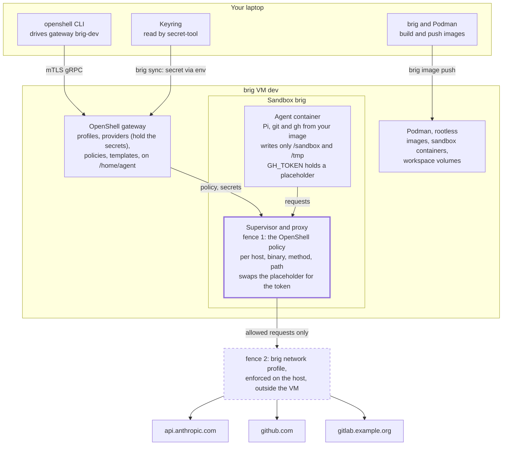
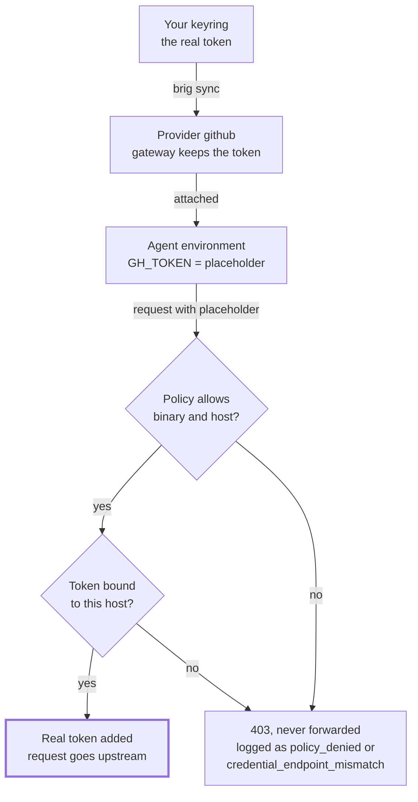
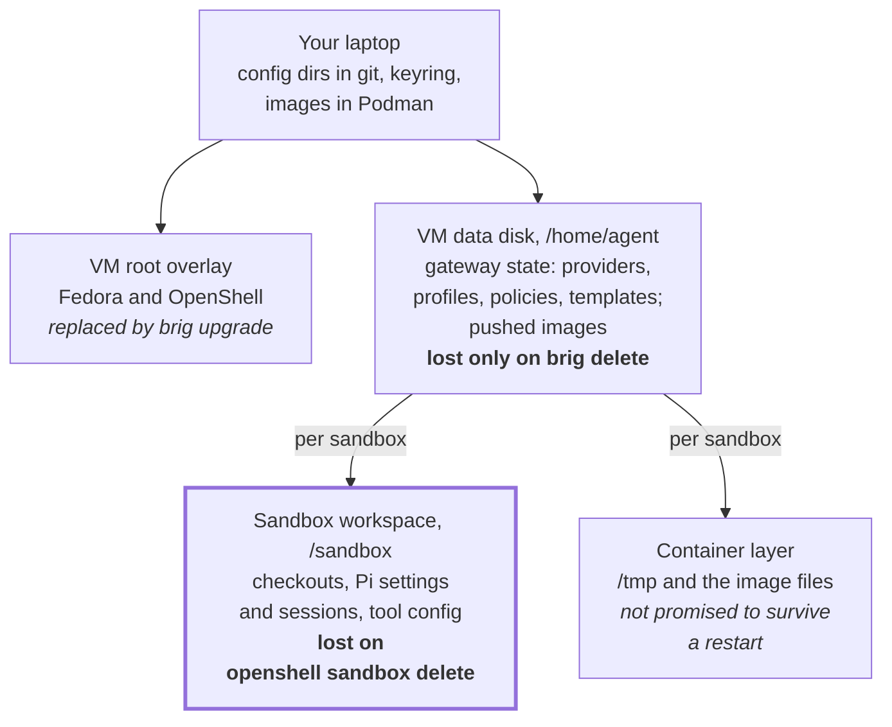

# OpenShell with brig: concepts, config and daily workflow

## How the pieces fit together

You drive everything from your laptop's `openshell` CLI; the agents run two
fences away from it. brig gives each VM its own OpenShell gateway, the gateway
runs each agent in a sandbox container, and every byte a sandbox sends leaves
through that sandbox's proxy. Your real secrets stay in the gateway and are
swapped into requests on the way out.



A request leaves only if the sandbox's policy and the VM's network profile
both allow it, and the real token is added inside the proxy, never in the
agent's container.

- **Host (your laptop).** The `openshell` CLI, your keyring (GNOME Keyring or
  KeePassXC, reached by `secret-tool`), Podman for building images, and brig.
  `eval "$(brig env dev)"` points the CLI at the VM `dev`, registered as
  gateway `brig-dev`.
- **brig VM.** Headless Fedora running the OpenShell gateway as user `agent`.
  The gateway stores profiles, providers, policies and sandbox records on the
  data disk at `/home/agent`, and starts sandboxes as rootless Podman
  containers.
- **Sandbox.** One container per agent session, built from an OCI image you
  choose with `--from`. Its workspace is `/sandbox`. It holds placeholders
  where your tokens would be.
- **Supervisor and proxy.** Sit beside each sandbox, enforce its policy, and
  swap placeholders for real credentials only on requests to the provider's
  endpoints.
- **Two network fences.** brig's network profile limits what the whole VM can
  reach and is enforced on the host, outside the VM. OpenShell's policy limits
  what each sandbox can reach, per host, port, binary and HTTP method, inside
  the VM. A request must pass both.

## Core concepts

Six objects do all the work. Profiles describe a service, providers hold your
secrets for it, policies say what a sandbox may touch, and sandboxes run the
agent. Gateways and workspaces are the containers around them.

| Object | What it is | Holds secrets | Created with | Lives |
| --- | --- | --- | --- | --- |
| Gateway | The control plane of one brig VM, registered on the host as `brig-NAME` | Yes, providers' | `brig create` | VM data disk |
| Workspace | A tenant inside a gateway. brig uses `default`; you are its admin | No | built in | gateway |
| Provider profile | A type definition: which env vars hold the credential, how it is sent (bearer, header, Basic, query), to which endpoints, from which binaries | No | `openshell profile import -f FILE` (workspace) or `--global` (platform) | gateway |
| Provider | A named instance of a profile with your actual token | Yes | `openshell provider create --name N --type PROFILE_ID --from-existing` | gateway |
| Policy | Filesystem, process and network rules for one sandbox | No | `--policy FILE` or `OPENSHELL_SANDBOX_POLICY` at create; `openshell policy set` later | sandbox record |
| Sandbox | A container running your agent image, with workspace `/sandbox` | Placeholders only | `openshell sandbox create --from IMAGE` | Podman in the VM |

A gateway starts with no profiles at all. The files in OpenShell's
[`providers/`](https://github.com/NVIDIA/OpenShell/tree/v0.1.2/providers)
directory, such as `github.yaml` and `anthropic.yaml`, are examples you import
and usually copy first. Their `binaries` list must name the executables in
your image: the shipped `anthropic.yaml` allows only `curl`, so a Node agent
like Pi needs `/usr/local/bin/node` added.

### Providers and sandboxes are many-to-many

A sandbox can carry several providers (`--provider anthropic --provider
github`), and one provider can serve many sandboxes. Attach or detach later
with `openshell sandbox provider attach SANDBOX PROVIDER`; only processes
started afterwards see the new variables. Each attached provider also adds a
network rule named `_provider_<name>` to the sandbox's effective policy, so
attaching `github` is what opens `api.github.com` and `github.com`.



The first check is the sandbox's network policy, the second the provider
profile's endpoints. A placeholder sent anywhere else gets a 403, never your
token.

The agent's environment holds a placeholder such as
`openshell:resolve:env:GH_TOKEN`, never the token. The proxy swaps it in
headers, Basic auth, query strings, URL paths, and, where a profile opts in,
JSON bodies and WebSocket messages. It does so only on requests to that
profile's endpoints, from its binaries. Client certificates and SSH keys
cannot be provided this way, so use HTTPS remotes for git.

### Which policy a sandbox gets

OpenShell picks the first that exists:

1. A global policy set on the gateway.
2. The policy given at create: `--policy FILE`, or the file named by
   `OPENSHELL_SANDBOX_POLICY`, which `brig env` sets from your config
   directory.
3. `/etc/openshell/policy.yaml` baked into the image.
4. The built-in default: workdir and `/tmp` writable; `/usr`, `/lib`, `/etc`
   and a few more read-only; no network at all.

That is the **base** policy. The **effective** policy is base plus the rules
contributed by attached providers; compare them with `openshell policy get
SANDBOX --base` and `--full`. Network rules hot-reload with `openshell policy
set SANDBOX --policy FILE --wait`. Filesystem and process settings are fixed
once the sandbox runs, so get them right in the default policy. Set
`enforcement: audit` on a new rule to log instead of block while you find out
what an agent needs.

### Templates

A template stores an image, environment, resources and driver config under a
name: `openshell sandbox template create pi --image localhost/pi-agent:1 ...`.
`openshell sandbox create --template pi` then takes only providers, labels and
policy. Templates live in the gateway, not on your laptop, so recreate them
after a fresh VM.

## Configuration as code: brig config directories

Keep profiles, providers and the default policy in directories, not in your
shell history. brig applies them to a VM's gateway at every `brig start` and
on `brig sync`, so a new or rebuilt VM is set up in one command. Split them in
two: a shared directory with no secrets, which you can put in git, and a
personal one that only points into your keyring.

```text
~/src/agent-openshell/              # shared, in git
  profiles/
    anthropic.yaml                  # copy of OpenShell's, binaries + node
    github.yaml                     # copy of OpenShell's, binaries checked
    gitlab-work.yaml                # your own, see the glab example
  policies/
    default.yaml                    # default policy for new sandboxes
~/.config/brig/openshell/           # personal, never in git
  providers/
    anthropic.yaml
    github.yaml
    gitlab-work.yaml
```

A provider file names the profile it instantiates and where each credential is
in your keyring. It never holds a value; brig refuses a `value:` key.

```yaml
# ~/.config/brig/openshell/providers/github.yaml
name: github
type: github                      # profile id
credentials:
  GH_TOKEN:
    secret_tool:                  # the arguments of `secret-tool lookup`
      lookup: [service, github.com, user, alice]
```

Store each secret once, then attach both directories to the VM and preview:

```sh
secret-tool store --label='GitHub token (agents)' service github.com user alice
secret-tool store --label='Anthropic key (agents)' service api.anthropic.com

brig update dev --add-openshell-config ~/src/agent-openshell \
                --add-openshell-config ~/.config/brig/openshell
brig sync dev --dry-run      # what would change, and where each token may be sent
brig sync dev
```

For new VMs, list both in `~/.config/brig/config.yaml` under
`openshell.configs`. To use another keyring client with the same `lookup`
arguments, such as a wrapper around `pass` or KeePassXC, set
`openshell.secret_tool` there; a config directory cannot set it.

The default policy is a complete policy file. Keep it small: no network rules
of its own, because attached providers add theirs. Once a file has a
`filesystem_policy`, the workspace is writable only with `include_workdir:
true`, and filesystem settings cannot change after a sandbox starts, so list
everything here:

```yaml
# policies/default.yaml
version: 1
filesystem_policy:
  include_workdir: true          # /sandbox
  read_only: [/bin, /usr, /lib, /etc, /proc, /dev/urandom, /var/log]
  read_write: [/tmp, /dev/null]
landlock:
  compatibility: best_effort
```

A project policy, such as `policies/brig.yaml` in the GitHub example, is this
file plus a `network_policies` section.

### What a sync does

| Item | Applied as | Updated when | Deleted |
| --- | --- | --- | --- |
| `profiles/*.yaml` | workspace profile, overriding a `--global` one with the same id | the file changes | only with `--prune`, only if brig created it |
| `providers/*.yaml` | provider, secret passed to `openshell` in its environment | a keyed fingerprint of a secret changes, or `--refresh-secrets` | only with `--prune`, only if brig created it |
| `policies/default.yaml` | exported by `eval "$(brig env dev)"` as `OPENSHELL_SANDBOX_POLICY` | each `openshell sandbox create` | never applied to running sandboxes |

Two safety rules matter when you share a directory. A provider's secret may be
sent to every endpoint in its profile, so read a shared profile's `endpoints`
before pairing it with your token; `--dry-run` prints them. And `brig start`
holds back a profile change that adds endpoints to a credential the gateway
already holds; only an explicit `brig sync` applies it, and it names the new
endpoints.

A sync does not touch templates, global policies or policies of existing
sandboxes. Create templates by hand, and change a running sandbox's network
rules with `openshell policy set`.

## Example: GitHub with gh

Out of the box a GitHub provider gives an agent read access: clone, fetch, `gh
pr view`, `gh api` GETs. Push and pull-request creation stay denied until a
policy grants them for a named repository. That split is deliberate, so grant
writes per sandbox, not in the shared default.

**1. Image.** Install `git` and `gh` so they land at `/usr/bin/git` and
`/usr/bin/gh`, the paths the profile's `binaries` list names. Use HTTPS
remotes; SSH keys cannot be provided.

**2. Profile.** Copy OpenShell's
[`providers/github.yaml`](https://github.com/NVIDIA/OpenShell/blob/v0.1.2/providers/github.yaml)
into `profiles/` unchanged if your binaries match. It sends `GITHUB_TOKEN` or
`GH_TOKEN` as a bearer token to `api.github.com` (REST and GraphQL, read-only)
and `github.com` (git clone and fetch only).

**3. Token and provider.** Create a fine-grained token limited to the
repositories agents may touch, with Contents and Pull requests read-write and
Metadata read. Store it and reference it:

```sh
secret-tool store --label='GitHub token (agents)' service github.com user alice
```

```yaml
# providers/github.yaml (personal directory)
name: github
type: github
credentials:
  GH_TOKEN:
    secret_tool:
      lookup: [service, github.com, user, alice]
```

**4. Use it.** `brig sync dev`, then `openshell sandbox create ... --provider
github`. Inside, `gh` works without `gh auth login` because it reads
`GH_TOKEN`. For `git`, the image sets gh as credential helper once,
system-wide: `git config --system credential.https://github.com.helper
'!/usr/bin/gh auth git-credential'`. git then sends the placeholder in Basic
auth, which the proxy decodes and resolves.

**5. Grant writes for one repository.** Keep a policy file per project next to
the default, here `policies/brig.yaml`: the default's content plus these
rules. Pass it at create with `--policy`, or apply it to a running sandbox
with `openshell policy set brig --policy policies/brig.yaml --wait`.

```yaml
network_policies:
  github_push_brig:
    name: github-push-brig
    endpoints:
      - host: github.com
        port: 443
        protocol: rest
        enforcement: enforce
        rules:
          - allow: { method: GET,  path: "/dennisklein/brig.git/info/refs*" }
          - allow: { method: POST, path: "/dennisklein/brig.git/git-upload-pack" }
          - allow: { method: POST, path: "/dennisklein/brig.git/git-receive-pack" }
    binaries:
      - path: /usr/bin/git
  github_prs_brig:
    name: github-prs-brig
    endpoints:
      - host: api.github.com
        port: 443
        protocol: rest
        enforcement: enforce
        rules:
          - allow: { method: "*", path: "/repos/dennisklein/brig/**" }
      - host: api.github.com
        port: 443
        path: /graphql
        protocol: graphql
        enforcement: enforce
        rules:
          - allow: { operation_type: query }
          - allow: { operation_type: mutation, fields: [createPullRequest] }
    binaries:
      - path: /usr/bin/gh
```

The GraphQL rule matters because `gh pr create` uses the `createPullRequest`
mutation, which the REST rule cannot see. The GraphQL mutation rule is not
scoped to one repository; the token's repository list is what limits it.
Always set `enforcement: enforce` on your own endpoints: on an inspected
endpoint, `audit` is the default and only logs.

When a request is denied, `openshell logs brig --since 5m --source sandbox`
shows the method, path and the rule that refused it; `openshell term` shows
the same live.

## Example: GitLab with glab

OpenShell ships no GitLab profile, so you write one: one host serves the API
and git, the token travels as `PRIVATE-TOKEN` for `glab` and as a Basic-auth
password for `git`. Replace `gitlab.example.org` with your instance, or
`gitlab.com`.

**1. Profile, in the shared directory.** Reads and clones are allowed, pushes
are not, as in GitHub's profile.

```yaml
# profiles/gitlab-work.yaml
id: gitlab-work
display_name: GitLab (work)
description: GitLab API and git over HTTPS on gitlab.example.org
category: source_control
credentials:
  - name: api_token
    description: GitLab personal or project access token
    env_vars: [GITLAB_TOKEN]
    required: true
    auth_style: header
    header_name: private-token
discovery:
  credentials: [api_token]
endpoints:
  - host: gitlab.example.org
    port: 443
    protocol: rest
    enforcement: enforce
    allow_encoded_slash: true        # API paths look like /projects/group%2Fproject
    rules:
      - allow: { method: GET, path: "**" }
      - allow: { method: HEAD, path: "**" }
      - allow: { method: OPTIONS, path: "**" }
      - allow: { method: POST, path: "/**/git-upload-pack" }
binaries: [/usr/bin/glab, /usr/local/bin/glab, /usr/bin/git, /usr/local/bin/git]
```

`allow_encoded_slash` is the non-obvious line. GitLab's API names projects by
their URL-encoded path, and OpenShell's proxy rejects `%2F` in a path unless
the endpoint allows it, so without it every `glab` call on a project is
denied.

**2. Provider, in the personal directory.** Use a personal or project access
token with `api` scope, or `read_api` plus `read_repository` while the agent
only reads.

```sh
secret-tool store --label='GitLab token (agents)' service gitlab.example.org user alice
```

```yaml
# providers/gitlab-work.yaml
name: gitlab-work
type: gitlab-work
credentials:
  GITLAB_TOKEN:
    secret_tool:
      lookup: [service, gitlab.example.org, user, alice]
```

**3. Image.** Install `glab` at `/usr/bin/glab` or `/usr/local/bin/glab`,
point it at your host, and give `git` a credential helper that reads the same
variable:

```dockerfile
ENV GITLAB_HOST=gitlab.example.org
RUN git config --system credential.https://gitlab.example.org.helper \
      '!f() { test "$1" = get && printf "username=oauth2\npassword=%s\n" "$GITLAB_TOKEN"; }; f'
```

Inside a checkout, `glab` also finds the host from the git remote.

**4. Grant writes for one project.** Add to that project's policy file:

```yaml
network_policies:
  gitlab_push_tools:
    name: gitlab-push-tools
    endpoints:
      - host: gitlab.example.org
        port: 443
        protocol: rest
        enforcement: enforce
        allow_encoded_slash: true
        rules:
          - allow: { method: GET,  path: "/group/tools.git/info/refs*" }
          - allow: { method: POST, path: "/group/tools.git/git-upload-pack" }
          - allow: { method: POST, path: "/group/tools.git/git-receive-pack" }
          - allow: { method: "*",  path: "/api/v4/projects/group%2Ftools/**" }
    binaries:
      - path: /usr/bin/git
      - path: /usr/bin/glab
```

The last rule lets `glab mr create`, `glab issue note` and the like write to
that project. Some `glab` commands look a project up by numeric ID or use
GraphQL at `/api/graphql`. If one is denied, take the exact path from
`openshell logs SANDBOX --source sandbox` and add it; with `enforcement:
audit` on a trial copy of the rule, you can collect the paths first without
breaking the agent.

## A Pi sandbox

[Pi](https://pi.dev) has no official image, so you build one. The rule that
makes it work: everything you curate (Pi, tools, your extensions and skills)
goes into the image under `/usr/local`; everything Pi writes (settings,
sessions) goes under `/sandbox`. The default policy lets a sandbox read `/usr`
and write only `/sandbox` and `/tmp`, and `/sandbox` is the one place that
persists.

| What | Where | Why |
| --- | --- | --- |
| Node, Pi, git, gh, glab, ripgrep, fd | image, `/usr/local` and `/usr/bin` | readable by default; updated by rebuilding the image |
| Your extensions, skills, prompts, themes | image, `/usr/local/share/pi-kit` (a Pi package) | loaded by path, so a new image brings new versions |
| Third-party Pi packages | image, `npm install -g` at build time | the sandbox cannot reach npm or GitHub at run time |
| Pi's agent dir: `settings.json`, `sessions/` | `/sandbox/.pi/agent` via `PI_CODING_AGENT_DIR` | writable and persistent; `~` is not writable |
| Project checkouts | `/sandbox/<repo>` | same workspace volume |
| Plugins under development | host directory, mounted read-only | edit on the host, `/reload` in Pi |

### The image

```text
pi-image/
  Containerfile
  pi-sandbox                  # start script, below
  etc/settings.json           # Pi settings for a fresh sandbox
  etc/AGENTS.md               # your standing instructions
  pi-kit/                     # your Pi package
    package.json
    extensions/  skills/  prompts/  themes/
```

```dockerfile
# Containerfile
FROM docker.io/library/node:24-bookworm-slim

ARG PI_VERSION=1.1.0
RUN apt-get update \
 && apt-get install -y --no-install-recommends \
      bash ca-certificates curl fd-find gh git jq ripgrep \
 && ln -s /usr/bin/fdfind /usr/local/bin/fd \
 && rm -rf /var/lib/apt/lists/*
# glab: install the .deb from its releases page here, at /usr/bin/glab

RUN npm install -g --ignore-scripts "@earendil-works/pi-coding-agent@${PI_VERSION}"
# Third-party Pi packages, pinned, installed like any npm package
RUN npm install -g --ignore-scripts @example/pi-tools@1.0.0

COPY pi-kit/ /usr/local/share/pi-kit/
RUN cd /usr/local/share/pi-kit && npm install --omit=dev --ignore-scripts
COPY etc/ /usr/local/etc/pi/
COPY --chmod=755 pi-sandbox /usr/local/bin/pi-sandbox

RUN git config --system credential.https://github.com.helper \
      '!/usr/bin/gh auth git-credential'

USER node
WORKDIR /sandbox
ENV PI_CODING_AGENT_DIR=/sandbox/.pi/agent \
    GH_CONFIG_DIR=/sandbox/.config/gh \
    GIT_CONFIG_GLOBAL=/sandbox/.gitconfig \
    PI_OFFLINE=1 PI_SKIP_VERSION_CHECK=1 PI_TELEMETRY=0
```

`fd` and `ripgrep` are in the image because Pi otherwise downloads them on
first use, which the sandbox blocks. The `PI_*` switches stop Pi's own update
checks and telemetry, which would only show up as denials in the logs. Do not
put files under `/sandbox` in the image: Podman copies them into a sandbox's
workspace once, at creation, and image updates never reach them again.

The start script seeds Pi's settings on a sandbox's first run and links what
the image should keep managing:

```sh
#!/bin/sh
# pi-sandbox: start Pi with this image's settings, extensions and skills
set -e
mkdir -p "$PI_CODING_AGENT_DIR"
[ -e "$PI_CODING_AGENT_DIR/settings.json" ] ||
  cp /usr/local/etc/pi/settings.json "$PI_CODING_AGENT_DIR/settings.json"
ln -sf /usr/local/etc/pi/AGENTS.md "$PI_CODING_AGENT_DIR/AGENTS.md"
exec pi "$@"
```

```json
{
  "packages": [
    "/usr/local/share/pi-kit",
    "/usr/local/lib/node_modules/@example/pi-tools"
  ],
  "defaultProvider": "anthropic"
}
```

Packages listed by absolute path load in place, without copying, so a sandbox
built from a newer image picks up the new code. `settings.json` is copied, not
linked, because Pi writes to it.

Build with Podman on the host and copy the image into the VM. Tag by date, so
you can tell images apart and go back:

```sh
podman build -t localhost/pi-agent:2026-10-08 pi-image/
brig image push dev localhost/pi-agent:2026-10-08
```

### Model credentials

Pi reads `ANTHROPIC_API_KEY`, so an Anthropic provider gives it a placeholder
and the proxy adds the real key. OpenShell's `anthropic.yaml` only allows
`curl`; copy it into your shared `profiles/` and set `binaries:
[/usr/local/bin/node, /usr/bin/curl]`. Then add `providers/anthropic.yaml`
pointing at your keyring, as for GitHub. OpenRouter works the same way with
OpenShell's `openrouter.yaml` and `OPENROUTER_API_KEY`. Do not run Pi's
`/login` in a sandbox: it would store a real token in `auth.json` there.

### Start it

```sh
eval "$(brig env dev)"
openshell sandbox create --name brig \
  --from localhost/pi-agent:2026-10-08 \
  --provider anthropic --provider github
# now in a login shell inside the sandbox
git clone https://github.com/dennisklein/brig && cd brig
pi-sandbox
```

Without a trailing command the sandbox's main process is a login shell, and
the sandbox stays after you leave. Press `Ctrl-P`, `Ctrl-Q` to detach with Pi
still working; `openshell sandbox connect brig` reattaches to the same shell.
For a second terminal, `openshell sandbox exec -n brig --tty -- bash -l`. To
reuse the image and settings, make it a template once: `openshell sandbox
template create pi --image localhost/pi-agent:2026-10-08`.

### Developing plugins without rebuilding

While you write an extension or skill, mount its directory instead of baking
it. Give the VM a read-only sandbox mount, which brig exposes as a Podman
volume (`brig show dev` names it, here `brig0`), and attach it to a sandbox:

```sh
brig update dev --add-mount ~/src/pi-kit:/pi-kit:ro,sandbox
brig stop dev && brig start dev     # mounts change at boot
openshell sandbox create --name kit-dev --from localhost/pi-agent:2026-10-08 \
  --provider anthropic --driver-config-json \
  '{"podman":{"mounts":[{"type":"volume","source":"brig0","target":"/usr/local/share/pi-kit-dev"}]}}'
# in the sandbox
pi-sandbox -e /usr/local/share/pi-kit-dev
```

Edits on the host appear in the sandbox at once; `/reload` in Pi picks them
up. The mount is read-only, so the agent cannot change your plugin source.
Mounting under `/usr` keeps it readable under the default policy. When the
plugin is done, copy it into `pi-kit/` and rebuild.

Repository-level `.pi/extensions`, `.pi/skills` and `.pi/prompts` also work,
after Pi asks you to trust the project. Package declarations in a repository's
`.pi/settings.json` do not, because Pi would have to fetch them from npm.

## Not losing project and agent state

Only one command loses a sandbox's work: `openshell sandbox delete`, which you
also run to move a sandbox to a new image. Everything else, from detaching to
`brig upgrade`, keeps `/sandbox`. So treat a sandbox as long-lived, push code
continuously, and copy Pi's sessions out before you delete.



The workspace volume holds the agent's work, and it is the one layer that a
routine step, moving a sandbox to a new image, removes.

| Event | Running Pi | `/sandbox`: checkouts, Pi settings and sessions | Gateway: providers, profiles, templates | Images in the VM |
| --- | --- | --- | --- | --- |
| `Ctrl-P`, `Ctrl-Q`; laptop sleep; network drop | keeps running | kept | kept | kept |
| Pi exits or crashes | gone; `pi-sandbox --continue` resumes | kept, sessions are written as you go | kept | kept |
| `openshell sandbox stop` / `start` | gone | kept | kept | kept |
| `brig stop` / `brig start` | gone | kept | kept, then re-synced | kept |
| `brig upgrade` | gone | kept: data disk | kept: data disk | kept |
| `openshell sandbox delete`, or recreate for a new image | gone | **lost** | kept | kept |
| `brig delete` | gone | **lost** | **lost**; config dirs rebuild it | **lost** |

### Habits that make deletes safe

1. **Git is the record for code.** Grant the sandbox push access to its
   repository and have the agent commit and push a work branch often. A
   sandbox you can delete at any moment is one whose last push is recent.
2. **Copy Pi's sessions out before a delete.** Sessions are JSONL files under
   `/sandbox/.pi/agent/sessions`, grouped by working directory, and `download`
   paths are relative to `/sandbox`:

   ```sh
   openshell sandbox download brig .pi/agent/sessions ~/pi-sessions/brig/
   ```

   After creating the replacement sandbox and cloning to the same path, upload
   them back so `pi-sandbox --continue` finds them:

   ```sh
   openshell sandbox upload brig ~/pi-sessions/brig/sessions .pi/agent
   ```

   Check where the files landed with `openshell sandbox exec -n brig -- ls -R
   .pi/agent/sessions` the first time. For a single conversation, Pi's
   `/export` writes HTML or JSONL instead.
3. **Keep anything you would miss out of the container layer.** Only
   `/sandbox` is a volume; `/tmp` and the rest of the container are not
   promised to survive a restart.
4. **Never use `--no-keep` for interactive work.** It deletes the sandbox, and
   its workspace, when the main process exits.
5. **Rebuild the VM from files, not memory.** Profiles, providers and the
   default policy come back from your config directories on the first `brig
   start`; recreate templates with a short script kept next to them.

The data disk holds every image and workspace and fills up over time: `df -h
/home/agent` in `brig ssh dev` shows how full it is, and `brig update dev
--data-disk 80GiB` grows it at the next boot.

## Daily workflow

Keep one VM and one long-lived sandbox per project. A day is then: start the
VM, reattach, work, detach. New projects get a new sandbox; finished ones are
pushed, their sessions copied, and deleted.

### Start of day

1. `brig start dev`. It boots the VM, re-registers the gateway and syncs your
   config directories; the keyring may ask to be unlocked for `secret-tool`.
2. `eval "$(brig env dev)"` in each terminal that runs `openshell`. It also
   sets `OPENSHELL_SANDBOX_POLICY` to your default policy.
3. `openshell sandbox list`. Start any that are `Stopped` with `openshell
   sandbox start brig`.
4. `openshell sandbox connect brig`, then in the sandbox `cd brig && git pull`
   and `pi-sandbox --continue` to resume the last conversation for that
   directory.

### During the day

- Keep a second terminal on `openshell term`, or `openshell logs brig --tail`,
  to see what the agent tries and what is denied.
- Grant missing access for this sandbox only: `openshell policy update brig
  ...` for a rule or two, `openshell policy set brig --policy FILE --wait` for
  a reviewed file. If the grant should last, put it in the project's policy
  file in your shared directory.
- Review on the host: `git fetch` the agent's branch and read the diff before
  anything merges.
- Detach with `Ctrl-P`, `Ctrl-Q` and let the agent run; `connect` brings you
  back to the same screen.
- Rotated a token? `secret-tool store` it again under the same attributes and
  run `brig sync dev`; brig notices the changed secret and updates the
  provider. Restart Pi if its requests fail afterwards.

### End of day

1. Have the agent push its work branch.
2. Either leave everything running, or free the laptop's memory with
   `openshell sandbox stop brig` and `brig stop dev`. Both keep `/sandbox`.

### New project

```sh
openshell sandbox create --name tools --template pi \
  --provider anthropic --provider gitlab-work \
  --policy ~/src/agent-openshell/policies/tools.yaml
```

Without `--policy`, the sandbox gets your default policy from
`OPENSHELL_SANDBOX_POLICY`. A provider's secret is reachable only from
sandboxes it is attached to, so attach just the ones the project needs.

### Finished project

Push, copy the sessions out as shown above, then `openshell sandbox delete
tools`.

## Keeping images up to date

There are two images and they move independently. The VM's base image carries
Fedora and OpenShell and is swapped in place by `brig upgrade`, keeping every
sandbox. The sandbox image carries Pi and your tools and reaches a sandbox
only when you recreate it.

| Image | Contains | Rebuild | Roll out | Existing sandboxes |
| --- | --- | --- | --- | --- |
| VM base image | Fedora, OpenShell gateway, Podman | `brig image build` | `brig upgrade dev` | kept, with their workspaces |
| Sandbox image | Node, Pi, your kit, gh, glab, git | `podman build --pull` | `brig image push dev IMAGE` | keep their old image until recreated |
| OpenShell CLI on the host | `openshell` | `sudo dnf upgrade openshell` | immediate | unaffected |

### VM and OpenShell

brig's package repository picks up each OpenShell release within a day.
Upgrading is three steps, in this order:

1. `brig image build` builds a base image with the newest Fedora packages and
   OpenShell; pin with `--openshell 0.1.2` if you want to wait.
2. `brig upgrade dev` moves the VM onto it and rolls back if it fails to come
   up. The data disk, and with it every provider, template, image and
   workspace, stays.
3. `sudo dnf upgrade openshell` on the host. `brig start` warns when the CLI
   and gateway versions do not match.

Read the OpenShell release notes before step 2: a release can change the
profile or policy schema, which shows up as `brig sync` or sandbox-start
errors. `brig image prune` then removes base images no VM uses.

### Sandbox image

Rebuild on a schedule, say weekly, with `--pull` for the base image's security
fixes. Change versions on purpose: bump `PI_VERSION` and each pinned package
in the Containerfile, so a rebuild without edits only refreshes the OS layer.

```sh
tag=$(date +%F)
podman build --pull -t localhost/pi-agent:$tag pi-image/
brig image push dev localhost/pi-agent:$tag
openshell sandbox template delete pi
openshell sandbox template create pi --image localhost/pi-agent:$tag
```

New sandboxes get the new image. Move an existing sandbox when you are at a
good point: push, copy its sessions out, delete it, create it again from the
template, clone, upload the sessions. Small projects can stay on an older
image for weeks; nothing forces a move.

Old images stay in the VM until you remove them, in `brig ssh dev`: `podman
images`, then `podman rmi localhost/pi-agent:OLD` for tags no sandbox uses.
Podman refuses to remove an image a container still uses.

## Quick reference and troubleshooting

| Task | Command |
| --- | --- |
| Point the CLI at a VM | `eval "$(brig env dev)"` |
| Apply config directories | `brig sync dev --dry-run`, then `brig sync dev` |
| List profiles, providers | `openshell profile list`, `openshell provider list` |
| New sandbox | `openshell sandbox create --name N --template pi --provider P ...` |
| Reattach, detach | `openshell sandbox connect N`; `Ctrl-P`, `Ctrl-Q` |
| Second shell | `openshell sandbox exec -n N --tty -- bash -l` |
| Attach a provider later | `openshell sandbox provider attach N P`, then restart the agent |
| See denials | `openshell logs N --since 10m --source sandbox`, or `openshell term` |
| Base vs effective policy | `openshell policy get N --base`, `--full` |
| Add one network rule | `openshell policy update N --rule-name R --binary PATH --add-endpoint HOST:443:read-only:rest:enforce --wait` |
| Replace the policy | `openshell policy set N --policy FILE --wait` |
| Copy files out, in | `openshell sandbox download N PATH DEST`; `openshell sandbox upload N SRC DEST` |
| Push an image into the VM | `brig image push dev localhost/IMAGE:TAG` |
| Upgrade VM, keep data | `brig image build && brig upgrade dev` |

| Symptom | Likely cause | Fix |
| --- | --- | --- |
| `create` cannot find the image | It is only in the host's Podman | `brig image push dev localhost/IMAGE:TAG`, and use the `localhost/` name |
| Sandbox stays in `Provisioning` | Invalid policy or provider; condition `ConfigurationInvalid` | `openshell sandbox get N -o json`, fix, then wait; after 300 s it turns to `Error` and needs `sandbox start` |
| Pi gets `policy_denied` from Anthropic | The profile's `binaries` lacks `/usr/local/bin/node` | Add it in your `profiles/anthropic.yaml`, `brig sync dev`, restart Pi |
| Any tool denied although a rule exists | Binary path differs, for example `/usr/local/bin` vs `/usr/bin` | `openshell sandbox exec -n N -- readlink -f "$(command -v TOOL)"` and list that path |
| `git push` denied, clone works | Profiles allow fetch only | Add the project's push rule (GitHub and GitLab sections) |
| Every `glab` project call denied | `%2F` in the API path | `allow_encoded_slash: true` on the GitLab endpoint |
| Writes to `~` fail in the sandbox | Only the workspace and `/tmp` are writable | Point config at `/sandbox`: `PI_CODING_AGENT_DIR`, `GH_CONFIG_DIR`, `GIT_CONFIG_GLOBAL` |
| `brig sync` says a secret is missing | No keyring entry with exactly those attributes | `secret-tool lookup service github.com user alice` on the host; store it again |
| `brig start` says it held back a profile change | The change adds endpoints to a credential already in the gateway | Review with `brig sync dev --dry-run`, then `brig sync dev` |
| `--driver-config-json` is rejected | The VM has no `sandbox` mount, so driver config is off | `brig update dev --add-mount DIR:/x:ro,sandbox`, restart the VM |
| Version warning at `brig start` | Host CLI and gateway differ | `sudo dnf upgrade openshell` |

## Sources

- OpenShell v0.1.2 [docs in its source
  tree](https://github.com/NVIDIA/OpenShell/tree/v0.1.2/docs): providers,
  profiles, policies (default policy, network rules, schema, managing
  policies), sandboxes (overview, runtimes, templates), and the tutorials [Run
  Pi with
  OpenRouter](https://github.com/NVIDIA/OpenShell/blob/v0.1.2/docs/tutorials/run-pi-with-openrouter.mdx)
  and [GitHub push
  access](https://github.com/NVIDIA/OpenShell/blob/v0.1.2/docs/tutorials/github-push-access.mdx).
- OpenShell's [provider profile
  examples](https://github.com/NVIDIA/OpenShell/tree/v0.1.2/providers) and its
  Podman driver source, for the `/sandbox` workspace volume and encoded-slash
  handling.
- Pi 1.1.0 documentation shipped in the
  [`@earendil-works/pi-coding-agent`](https://www.npmjs.com/package/@earendil-works/pi-coding-agent)
  package: configuration, environment variables, packages, sessions,
  containerization.
- brig's [README](../README.md) and source.
